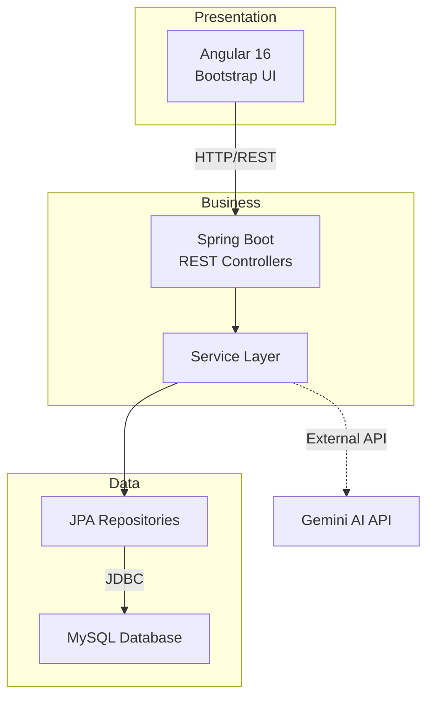
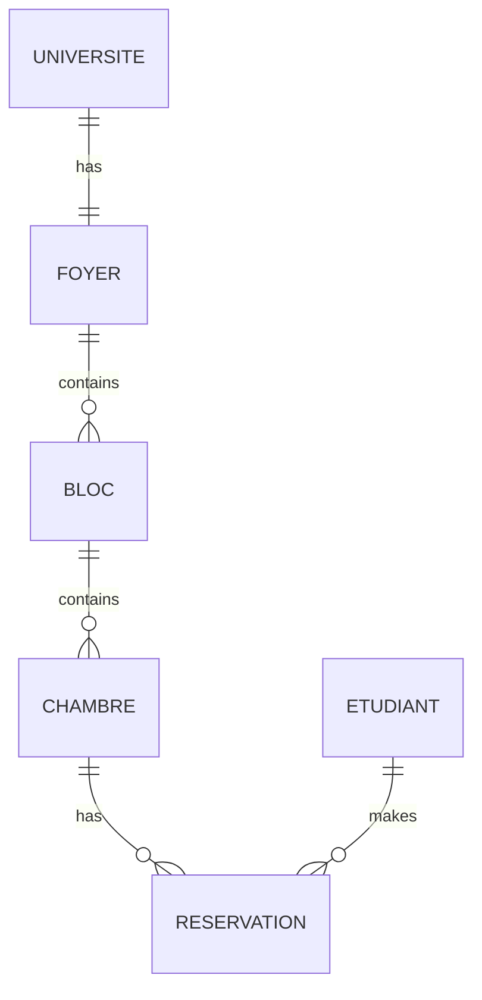

# University Housing Management System

## Travail Réalisée Par : M1 ISIDS
Houssem Bjaoui &
Wassim Guessmi

Full-stack application for managing university housing infrastructure, student accommodations, and reservations with AI-powered assistance.

## Architecture Overview

**Three-Tier Architecture:** Presentation (Angular) → Business Logic (Spring Boot) → Data Access (JPA/MySQL)



**Communication Flow:** Angular Component → HTTP Service → REST Controller → Service Layer → Repository → Database

## Project Structure

### Backend
```
src/main/java/com/houssem/housing_management/
├── config/          # CORS, Environment configuration
├── Controller/      # REST API endpoints
├── Services/        # Business logic implementation
├── ServiceImpl/     # Service interfaces
├── Repositories/    # JPA data access
├── Entities/        # JPA entity models
├── DTOs/            # Data transfer objects
├── mapper/          # Entity-DTO conversion
└── Enum/            # Enumerations (TypeChambre)
```

### Frontend
```
src/app/
├── core/services/   # HTTP API services
├── features/        # Feature modules (CRUD components)
├── shared/          # Models, reusable components (chat widget)
├── layout/          # Navigation (navbar, sidebar)
└── environments/    # Environment configuration
```

## Database Model

### Entities

**Universite:** `idUniversite`, `nomUniversite`, `adresse`  
**Foyer:** `idFoyer`, `nomFoyer`, `capaciteFoyer`  
**Bloc:** `idBloc`, `nomBloc`, `capaciteBloc`  
**Chambre:** `idChambre`, `numeroChambre`, `typeC` (SIMPLE/DOUBLE/TRIPLE)  
**Etudiant:** `idEtudiant`, `nomEt`, `prenomEt`, `cin`, `ecole`, `dateNaissance`  
**Reservation:** `idReservation`, `anneeUniversitaireDebut`, `anneeUniversitaireFin`, `estValide`

### Entity Relationships



## Tech Stack

| Layer | Technologies |
|-------|-------------|
| Frontend | Angular 16.2, TypeScript 5.1, Bootstrap 5.3, RxJS 7.8 |
| Backend | Spring Boot 4.0.5, Java 17, Maven, Lombok, Dotenv |
| Database | MySQL 8.x, JPA/Hibernate |
| AI | Google Gemini API |

## API Endpoints

| Module | Method | Endpoint | Description |
|--------|--------|----------|-------------|
| Universite | POST | `/universite/addOrUpdate` | Create/Update university |
| Universite | PUT | `/universite/affecterFoyer/{idFoyer}/{nom}` | Assign foyer |
| Foyer | POST/PUT | `/foyer/add`, `/foyer/update` | CRUD operations |
| Bloc | PUT | `/bloc/affecterBlocAFoyer/{nomBloc}/{nomFoyer}` | Assign bloc to foyer |
| Chambre | POST/PUT | `/chambre/add`, `/chambre/update` | CRUD operations |
| Etudiant | GET/POST/PUT | `/etudiant/*` | Student management |
| Reservation | POST | `/reservation/ajouter?numChambre=&cin=` | Create reservation |
| Chatbot | POST | `/api/chatbot/ask` | AI assistant |

## Configuration

**Backend:** `src/main/resources/application.yaml`
```yaml
spring:
  datasource:
    url: jdbc:mysql://localhost:3306/gestion_foyer
    username: root
    password: 
  jpa:
    hibernate:
      ddl-auto: update
```

**Environment:** `university-housing-management-Backend/.env`
```env
GEMINI_API_KEY=your_gemini_api_key_here
```

## Installation & Execution

**Prerequisites:** Java 17+, Node.js 16+, MySQL 8.x

**Database Setup:**
```sql
CREATE DATABASE gestion_foyer;
```

**Backend:**
```bash
cd university-housing-management-Backend
./mvnw spring-boot:run
```

**Frontend:**
```bash
cd frontend
npm install
npm start
```

**Access:** `http://localhost:4200`

## Key Features

- Complete CRUD operations for all entities
- Hierarchical assignment management (University → Foyer → Bloc → Chambre)
- Student reservation system with validation
- AI-powered chatbot with housing context
- Responsive UI with Bootstrap 5
- Real-time data synchronization
